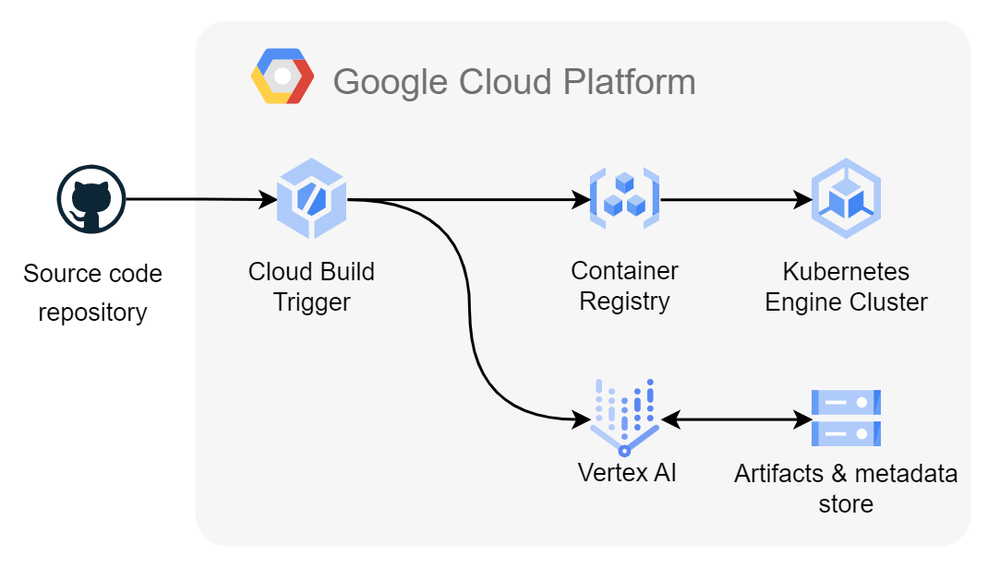
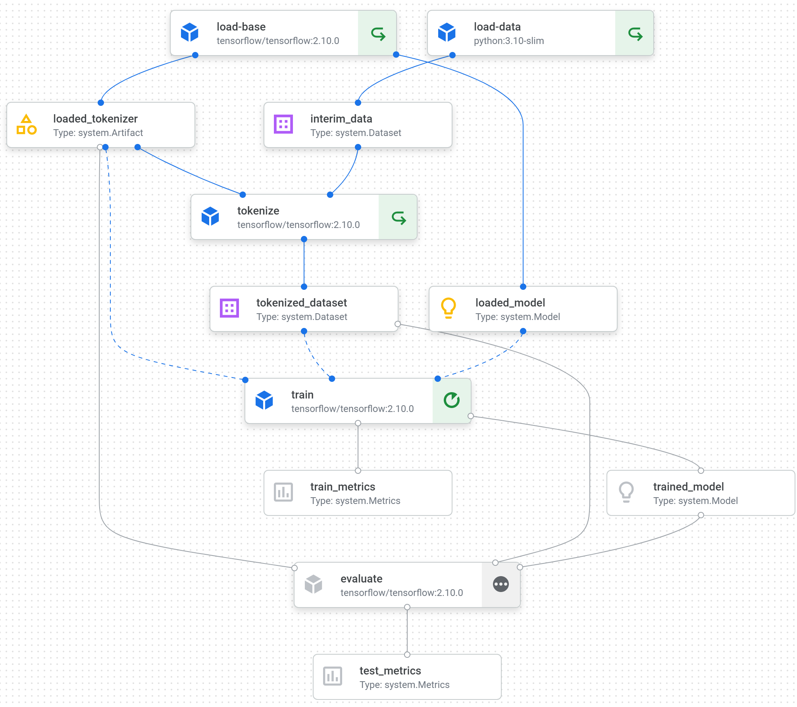

# Claim veracity checker

The repository contains the source code for the training of and inference with the claim veracity machine learning system. The system is built upon the longformer tuned to PUBHEALTH dataset referred to as the base model. The inference demos use the base model to infer veracity with the ability to switch to the custom developed model. The training pipeline allows to further fine tune the base longformer (or any other model defined by the `checkpoint` training parameter) to any dataset defined by the `dataset_name` training parameter.

## Dataset

The base longformer model as well the development version were tuned to [PUBHEALTH dataset](https://huggingface.co/datasets/health_fact).

## Base model

[The base model](https://huggingface.co/nbroad/longformer-base-health-fact) used in training is derived from the [longformer architecture](https://arxiv.org/abs/2004.05150). The Hugging Face model repo contains all the details of the base model, its training hyper parameters and training and evaluation results.

To put the base model into production and collect insights into the base model performance faster, two demos were implemented differing in approaches: Hugging Face Spaces and Google Kubernetes Engine (GKE).

The GKE would allows more flexibility and scalability with the serving app development, testing and deploying as the serving infrastructure is fully controllable.

### Demos

- [The Hugging Face Spaces demo](https://huggingface.co/spaces/ivanokhotnikov/longformer-base-health-fact)

- [The GKE demo of the base model](http://130.211.14.19)

## Cloud architecture

The implemented cloud architecture is depicted below. It includes the current source code repository, Google Cloud Build triggers to start rebuilding serving and training docker containers, Google Cloud Registry to store the built containers, Google Kubernetes Engine cluster to serve the deployment of the inference serving app and Google Cloud Storage buckets to store training artifacts, metrics, models and runs metadata.




## Training

To enable further development and fine tuning from the base model, the cloud training workflow has been implemented with Vertex AI in Google Cloud Platform. The workflow allows to specify different checkpoint for the base model from The Hugging Face Models Hub, dataset as well as training parameters.

To start training run:
1. Set up and activate the local virtual environment:

```
python -m venv .venv
source .venv/Scripts/activate
python -m pip install --upgrade pip setuptools
pip install -r conf/requirements-train.txt
```

2. Install pre-commit hooks: `pre-commit install`
3. Submit training job to Vertex AI: `python src/training.py [OPTIONS]`

The command line interface OPTIONS include the following:

    --exp_name EXP_NAME
    --checkpoint CHECKPOINT
    --dataset_name DATASET_NAME
    --batch_size BATCH_SIZE
    --epochs EPOCHS
    --learning_rate LEARNING_RATE
    --decay_rate DECAY_RATE

4. To track the training progression, follow the generated link in the terminal

### Workflow

The implemented training workflow is described by the directed acyclic graph (DAG) below. The workflow (or pipeline) and individual stages (or components) was specified with Kubeflow SDK.



## Continuous deployment and retraining

[`serving.yaml`](serving.yaml) and [`training.yaml`](training.yaml) specify the steps the Google Cloud Build executor performs at **push to `master` branch of the current repository** to continuously deploy the inference app with the base model and to retrain the model, i.e. to trigger training workflow. The list of steps is expandable, in the present version it consists of the following:

Serving:

1. Build the docker image from [serving.dockerfile](serving.dockerfile)
2. Push the built image to Google Container Registry (GCR)
3. Update the existing deployment resource on GKE with the built image
4. Restart the existing deployment to rollout the image changes

Retraining:

1. Build the docker image from [training.dockerfile](training.dockerfile)
2. Push the built image to Google Container Registry (GCR)
3. Run the image to instantiate a new training workflow run
